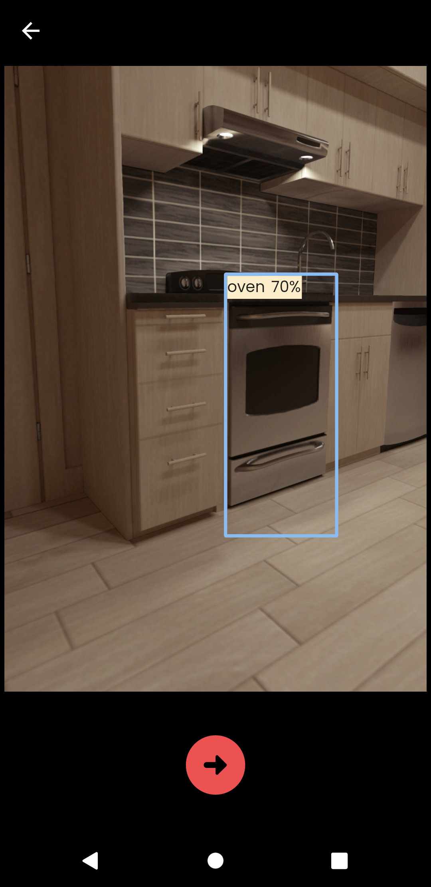
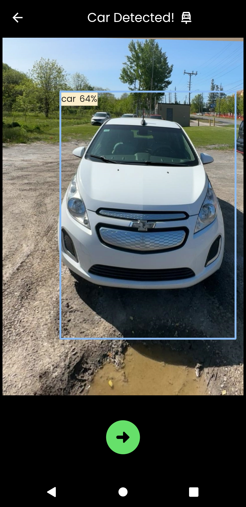
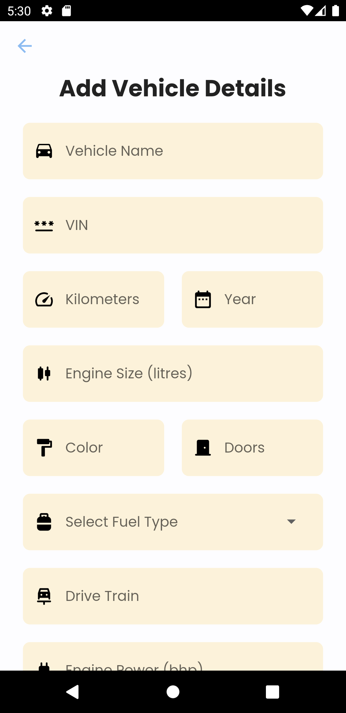
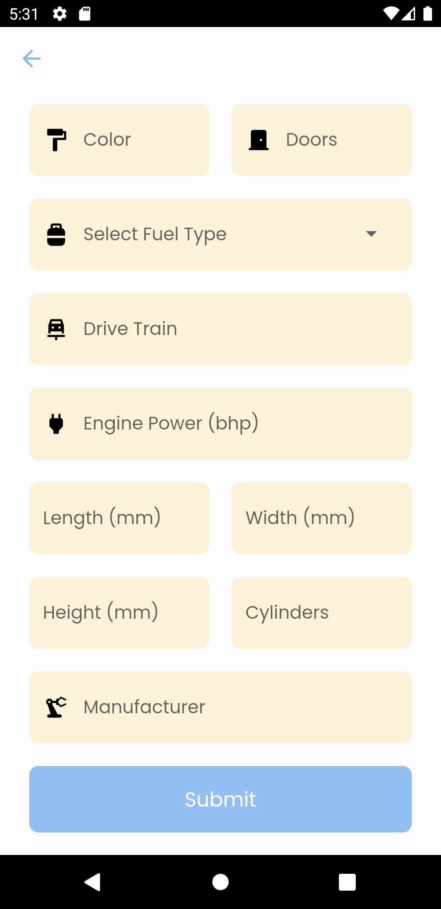

# SnapDrive

App to detect object, detect vehicle orientation and add vehicle data.

## How to use

Step 1:

Clone this repo by using following command:

```
git clone git@github.com:PratikKhadka100/SnapDrive-Flutter.git
```

Step 2:

Go to the project root and exceute the following command:

```
flutter pub get
```

Step 3:

Run the app using following command:

```
flutter run
```

## Packages and Tools used

- Camera: https://pub.dev/packages/camera
- Tflite: https://pub.dev/packages/tflite
- Image: https://pub.dev/packages/image
- HTTP: https://pub.dev/packages/http
- Shared Preferences: https://pub.dev/packages/shared_preferences
- Intl: https://pub.dev/packages/intl
- Form Validator: https://pub.dev/packages/form_validator

## Screenshots

<div style="display: grid; grid-template-columns: 1fr 1fr; row-gap: 50px;">
  <div>
    
  </div>
  <div>
    
  </div>
  <div>
    
  </div>
  <div>
    
  </div>
  <div>
    
  </div>
   <div>
    
  </div>
</div>
